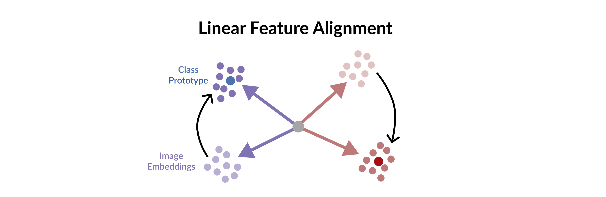

# Linear Feature Alignment

This repo is the official code base for Black Box Few-Shot Adaptation for Vision-Language models.
It contains the following implementations:

- **LFA** (supervised and unsupervised variants).
- **LFA** for V-L models: CLIP, ALIGN, FLAVA, and ALT-CLIP. In additiona to uni-modal models (text encoder:[OpenAI Embeddings](https://platform.openai.com/docs/guides/embeddings), visual encoders: [BYOL](https://arxiv.org/abs/2006.07733), [Barlow Twins](https://arxiv.org/abs/2103.03230) and [MoCo v3](https://arxiv.org/abs/2104.02057)).
- **LFA** for image and video datasets.
- Other methods:
    - Image soft-prompting: [CoOp](https://arxiv.org/abs/2109.01134) and [CoCoOp](https://arxiv.org/abs/2203.05557).
    - [Video Prompting](https://arxiv.org/abs/2112.04478).
- Datasets
    - 11 standard image classification datasets.
    - 4 ImageNet variants for domain generalization.
    - 5 Video datasets, but the results and parameters are reported only for UCF101 and HMDB51.

## Approach 



**LFA** is a black-box method for V-L few-shot adaptation that:
- Operates on pre-computed image and text features and hence works without access to the model's weights
- It is orders of magnitude faster at training time
- It is amenable to both supervised and unsupervised training,
- It can be used to align image and text features computed from uni-modal models.

LFA is initialized from a closed-form solution to a least-squares problem, and then it is iteratively
updated by minimizing a re-ranking loss. Despite its simplicity, our approach can even surpass soft-prompt learning methods
as shown by extensive experiments on 11 image and 2 video datasets.

## Installs & Data

After installing PyTorch, torchvision and their dependencies, to run the LFA, we need to install the following:

```bash
pip install ftfy regex tqdm loguru scikit-learn
```

For aligning uni-modal models, you'll need both Open-AI API and some self-supervised vision models,
which will use [mmselfsup](https://github.com/open-mmlab/mmselfsup) for:
```bash
pip install openai
pip install -U openmim
mim install mmengine
mim install 'mmcv>=2.0.0rc1'
pip install 'mmselfsup>=1.0.0rc0'
```

If you also want to run the unsupervised variants,
we'll need to also install [GeomLoss](https://www.kernel-operations.io/geomloss/):
```bash
pip install pykeops
pip install geomloss
```

## Data

For image datasets, please follow the instruction of
CoOp here: [DATASETS.md](https://github.com/KaiyangZhou/CoOp/blob/main/DATASETS.md).

For video dataset, HMDB51 can be downloaded
from [here](HMDB51) and UCF101 from [here](https://www.crcv.ucf.edu/data/UCF101.php). Note that
K400 & K700 and SomethingSomething v2 are also implemented, but are not tested.

Note that for video runs, we use torchvision VideoReader as the video decoder. VideoReader with ffmpeg 4.3 causes segfault
due to some problem for the 4.3 version. However, it should work with ffmpeg 4.2.
Additionaly, we differentiate between UCF101 used for video runs and image runs by calling the image version: `ImageUCF101`


## Running LFA

### Standard Few-shot classification

For standard few-shot classification results, run the following for 16-shot, `ViT-B/16` backbone:

```bash
NitersCaltech101=1000
NitersDescribableTextures=1000
NitersEuroSAT=100
NitersFood101=100
NitersFGVCAircraft=1000
NitersOxfordFlowers=100
NitersOxfordPets=30
NitersStanfordCars=2000
NitersSUN397=100
NitersImageUCF101=200
NitersImageNet=200

FEATURES_PATH="saved_features"
DATASET_NAME="ImageNet"
DATASET_PATH=""

python feature_alignment.py --model-type clip --use-template --five-crop \
    --save-path $FEATURES_PATH --n-iters $NitersImageNet \
    --config config_files/cfg_image.yaml RNG_SEED 1 MODEL.VIZ_BACKBONE ViT-B/16 \
    DATA.DATASET_NAME $DATASET_NAME DATA.DATA_PATH $DATASET_PATH DATA.N_SHOT 16
```

First, set `DATASET_PATH` to the correct path of the folder containing all the image datasets, then
run the above.

The above run is for `ImageNet`. For other dataset, you can change the `DATASET_NAME` to run it on them,
but don't forget to also change `-n-iters $NitersImageNet` to its corresponding value to
reproduce the exact results in the paper.

Change `MODEL.VIZ_BACKBONE` run on the other backbones (`RN50`, `RN101` and `ViT-B/16`) and `DATA.N_SHOT`
to run on with a different number of support examples per class.

Note that to reproduce the paper's results, we need the average of 3 runs (`RNG_SEED` to be set to 1, 2 and 3).

### Base-to-new

For base to new generalization experiments, the process is similar, we just need to
set the flat `DATA.USE_BASE_AND_NEW` to True:


```bash
NitersCaltech101=40
NitersDescribableTextures=100
NitersEuroSAT=50
NitersFood101=50
NitersFGVCAircraft=100
NitersOxfordFlowers=50
NitersOxfordPets=10
NitersStanfordCars=50
NitersSUN397=50
NitersImageUCF101=100
NitersImageNet=100

FEATURES_PATH="saved_features"
DATASET_NAME="ImageNet"
DATASET_PATH=""

python feature_alignment.py --model-type clip --use-template --five-crop --beta-procrustes 0.9 \
    --save-path $FEATURES_PATH --n-iters $NitersImageNet \
    --config config_files/cfg_image.yaml RNG_SEED 1 $CONFIG_FLAGS \
    DATA.DATASET_NAME $DATASET_NAME DATA.DATA_PATH $DATASET_PATH \
    MODEL.VIZ_BACKBONE ViT-B/16 DATA.USE_BASE_AND_NEW True DATA.N_SHOT 16
```

Similarly, set `DATASET_PATH` to the correct path of the folder and change `DATA.DATASET_NAME`
and `--n-iters $NitersImageNet` to run on other datasets.


### Domain Generalization

For domain generalization, we train on `ImageNet` and test on one of its variants:
`ImageNetA`, `ImageNetR`, `ImageNetSketch` and `ImageNetV2`.

For `ViT-B/16` backbone, run the following:

```bash
TARGET_DATASET="ImageNetA"
FEATURES_PATH="saved_features"
DATASET_PATH=""

python feature_alignment.py --model-type clip --use-template --five-crop --n-iters 200 \
    --save-path $FEATURES_PATH --config config_files/cfg_image.yaml \
    RNG_SEED 1 MODEL.VIZ_BACKBONE ViT-B/16 DATA.N_SHOT 16 \
    DATA.DATASET_NAME ImageNet DATA.DATA_PATH $DATASET_PATH DATA.TARGET_DATASET $TARGET_DATASET
```

The above run is with `ImageNetA` as the target dataset, you can change it to run on the other
target datasets. For RN50, reduce the number of iterations to `--n-iters 100` to get the same results as in the paper.


### Aligning Uni-modal models

To these experiments, we'll use OpenAI embeddings and self-supervised visual backbones.
First, download the visual backbones and add them to `.saved_models/` as
follows (source: [mmselfsup](https://mmselfsup.readthedocs.io/en/1.x/model_zoo.html)):

```bash
mkdir saved_models
cd saved_models

# download moco v3
wget https://download.openmmlab.com/mmselfsup/1.x/mocov3/mocov3_resnet50_8xb512-amp-coslr-800e_in1k/mocov3_resnet50_8xb512-amp-coslr-800e_in1k_20220927-e043f51a.pth

# download barlow twins
wget https://download.openmmlab.com/mmselfsup/1.x/barlowtwins/barlowtwins_resnet50_8xb256-coslr-300e_in1k/barlowtwins_resnet50_8xb256-coslr-300e_in1k_20220825-57307488.pth

# download byol
wget https://download.openmmlab.com/mmselfsup/1.x/byol/byol_resnet50_16xb256-coslr-200e_in1k/byol_resnet50_16xb256-coslr-200e_in1k_20220825-de817331.pth
```

Next, we need to set the OpenAI API key. First go to your account, copy it and then set it
as shell an environment variable:
```bash
export OPENAI_API_KEY=<your_api_key>
```

Now we are ready to run LFA similar to the previous cases, to train, run the following:

```bash
VISUAL_BACKBONE="mocov3"
FEATURES_PATH="saved_features"
DATASET_NAME="ImageNet"
DATASET_PATH=""

python feature_alignment.py --model-type $VISUAL_BACKBONE --beta-procrustes 0.1 \
    --n-iters 800 --save-path $FEATURES_PATH --config config_files/cfg_image.yaml RNG_SEED 1 \
    MODEL.VIZ_BACKBONE ViT-B/16 DATA.DATASET_NAME $DATASET_NAME DATA.DATA_PATH $DATASET_PATH DATA.N_SHOT 16 
```

The above run is for `mocov3` backbone, you can change it to run on the other backbones (`byol` and `barlowtwins`)
and for other datasets.


### Unsupervised LFA

To run the unsupervised version of LFA, simple set the flag `--unsupervised`, the following is an example
for `ImageNet`:

```bash
DATASET_PATH=""
FEATURES_PATH="saved_features"

python feature_alignment.py --unsupervised --model-type clip --use-template --five-crop  --n-unsup-iters 5 --n-iters 200 \
     --save-path $FEATURES_PATH --config config_files/cfg_image.yaml RNG_SEED 1 MODEL.VIZ_BACKBONE ViT-B/16 \
    DATA.DATASET_NAME ImageNet DATA.DATA_PATH $DATASET_PATH DATA.N_SHOT 16
```

Here we apply 5 unsupervised refinement steps, each step for 200. For other datasets, and similar to
the previous cases, the number of iterations need to be change for each dataset as in the standard
few shot case.


## Running Soft-Prompt baselines:

This repo also reproduces the soft-prompting
baselines: image soft-prompting: [CoOp](https://arxiv.org/abs/2109.01134)
and [CoCoOp](https://arxiv.org/abs/2203.05557) and [Video Prompting](https://arxiv.org/abs/2112.04478).

To run CoOp:

```bash
DATASET_NAME="ImageNet"
DATASET_PATH=""

python train.py --config config_files/cfg_image.yaml RNG_SEED 1 \
    DATA.DATASET_NAME $DATASET_NAME DATA.DATA_PATH $DATASET_PATH DATA.N_SHOT 16
```

The same options/datasets presented for LFA also apply here. For CoCoOp, simply set `MODLE.IMG_CONDITIONING` to True:
```bash
DATASET_NAME="ImageNet"
DATASET_PATH=""

python train.py --config config_files/cfg_image.yaml RNG_SEED 1 MODEL.FRAME_AGGREGATION mean \
    DATA.DATASET_NAME $DATASET_NAME DATA.DATA_PATH $DATASET_PATH DATA.N_SHOT 16 MODLE.IMG_CONDITIONING True
```

Note that here, you might need to reduce the batch size to fit the model in the GPU memory?

To run Video prompting with mean over the frames:

```bash
DATASET_NAME="UCF101"
DATASET_PATH=""

python train.py --config config_files/cfg_video.yaml RNG_SEED 1 \
    DATA.DATASET_NAME $DATASET_NAME DATA.DATA_PATH $DATASET_PATH DATA.N_SHOT 16
```

Set `DATASET_NAME` to either `UCF101` and `HMDB51` and `DATASET_PATH` to the path of the folders
containing the video per each class for each dataset.

To run with a transformer layer, simply change `MODEL.FRAME_AGGREGATION mean` to 
`MODEL.FRAME_AGGREGATION transformer_1`. Here `transformer_1` mean a single transformer layer
is added on top of the frozen per-frame features.

Note after training, you can also run LFA starting from these soft-prompts, simple use `--model-type clip_prompt`
for this and use `--model-chekpoint` to point to the model's checkpoint to load the leanred prompts.


## Citation

If you use this code in your research, please kindly cite the LFA following paper:
```
@inproceedings{ouali2023black,
  title={Black Box Few-Shot Adaptation for Vision-Language models},
  author={Ouali, Yassine and Bulat, Adrian and Martinez, Brais and Tzimiropoulos, Georgios},
  booktitle={Proceedings of the International Conference on Computer Vision (ICCV)},
  year={2023}
}
```

Of course, if you use either [CoOp](https://arxiv.org/abs/2109.01134),
[CoCoOp](https://arxiv.org/abs/2203.05557) or [Video Prompting](https://arxiv.org/abs/2112.04478),
please cite the corresponding papers.
